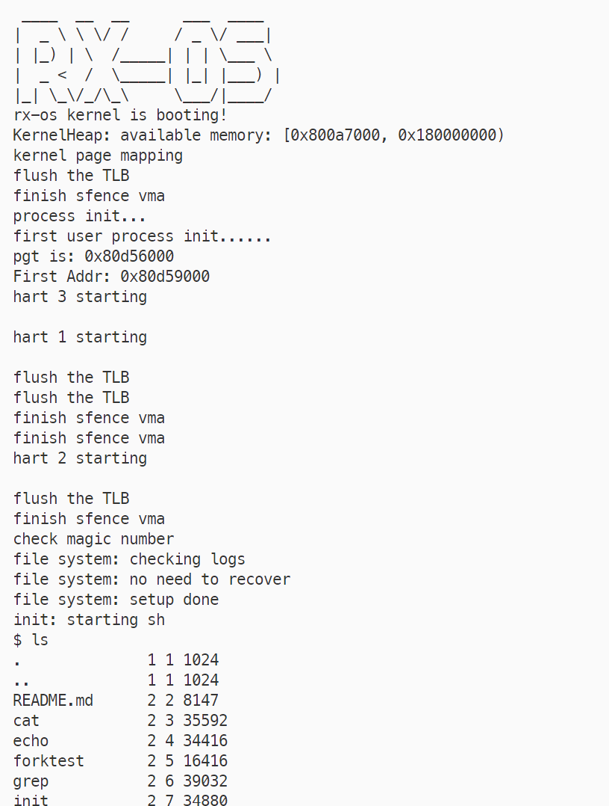

# RX-OS


RX-OS(Rust Extended Operating System)是基于Rust的操作系统实现，基于RAII模式重写[xv6](https://github.com/mit-pdos/xv6-riscv.git)操作系统，从[xv6-rust](https://github.com/Ko-oK-OS/xv6-rust.git)改进而来，目前还在持续开发以及改进中。



## 环境准备

首先要安装Rust的工具链以编译内核，安装方法可以查看Rust官方[Rust](https://www.rust-lang.org/tools/install)。

Shell (Mac, Linux):

```sh
curl --proto '=https' --tlsv1.2 -sSf https://sh.rustup.rs | sh
```

Rust能够对工具链进行统一的管理，为了编译RISCV64目标的程序，你需要添加相对应的工具链，同时库中用了许多unstable等特性，所以你还需要添加Nightly的工具链：

```sh
rustup install nightly
rustup target add riscv64gc-unknown-none-elf
```

内核可以方便的运行在QEMU模拟器上，你还需要提前安装RISCV64的QEMU模拟器：

在Linux下安装QEMU可以按如下方法

```sh
wget https://download.qemu.org/qemu-5.0.0.tar.x  
tar xvJf qemu-5.0.0.tar.xz  
cd qemu-5.0.0  
./configure --target-list=riscv32-softmmu,riscv64-softmmu   
make -j$(nproc)  
sudo make install  
```


## 运行

运行RX-OS需要构建内核以及一系列的程序，程序都是透过内定义的ABI调用操作系统的服务（系统调用），目前可以直接将先前xv6系统中的用户程序运行在内核之上，未来也将以Rust的方式向程序提供接口（标准库的形式）。

用户程序保存中/xv6-user内，Makefile中定义了其程序的编译过程。

RX-OS的内核目前还没实现用Bootloader加载操作系统，所以内核本身是一个直接运行在CPU上的裸机程序，用xv-mkfs中的程序构建其镜像即可，这一过程也在Makefile中定义。

最后，Cargo会直接调用QEMU运行内核，运行的具体命令可以在/.cargo/cargo.toml中找到。

如下命令集成了这一过程。

```sh
make qemu
```

## TODO

- [ ] bootloader
- [ ] VGA

## 额外资源

- **[xv6](https://github.com/mit-pdos/xv6-riscv.git)**: xv6系统的官方C实现。
- **[xv6-rust](https://github.com/Ko-oK-OS/xv6-rust.git)**: rx-os主要参考的实现。
- **[rust](https://www.rust-lang.org/)**: 更多关于Rust的内容请见Rust官网。

## Contributing

We appreciate your help! 